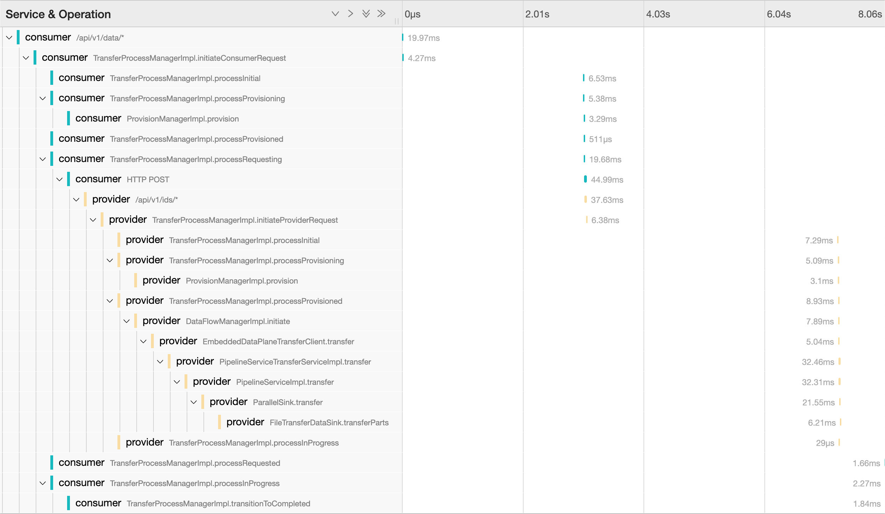

# Telemetry with OpenTelemetry and Micrometer

This sample builds on top of [sample transfer-01-file-transfer](../transfer-01-file-transfer/README.md) to show how you
can:

- generate traces with [OpenTelemetry](https://opentelemetry.io) and collect and visualize them with [Jaeger](https://www.jaegertracing.io/).
- automatically collect metrics from infrastructure, server endpoints and client libraries with [Micrometer](https://micrometer.io)
  and visualize them with [Prometheus](https://prometheus.io).

For this, this sample uses the Open Telemetry Java Agent, which dynamically injects bytecode to capture telemetry from
several popular [libraries and frameworks](https://github.com/open-telemetry/opentelemetry-java-instrumentation/tree/main/instrumentation).

In order to visualize and analyze the traces and metrics, we use
[OpenTelemetry exporters](https://opentelemetry.io/docs/instrumentation/js/exporters/) to export data into the Jaeger
tracing backend and a Prometheus endpoint.  

## Prerequisites

Download the [opentelemetry-javaagent.jar](https://github.com/open-telemetry/opentelemetry-java-instrumentation/releases/download/v1.12.0/opentelemetry-javaagent.jar) 
and place it in the root folder of this sample.

## Run the sample

We will use a single docker-compose to run the consumer, the provider, and a Jaeger backend.
Let's have a look to the [docker-compose.yaml](docker-compose.yaml). We created a consumer and a provider service with
entry points specifying the OpenTelemetry Java Agent as a JVM parameter.
In addition, the [Jaeger exporter](https://github.com/open-telemetry/opentelemetry-java/blob/main/sdk-extensions/autoconfigure/README.md#jaeger-exporter)
is configured using environmental variables as required by OpenTelemetry. The
[Prometheus exporter](https://github.com/open-telemetry/opentelemetry-java/blob/main/sdk-extensions/autoconfigure/README.md#prometheus-exporter)
is configured to expose a Prometheus metrics endpoint.

To run the consumer, the provider, and Jaeger execute the following commands in the project root folder:

```bash
./gradlew transfer:transfer-04-open-telemetry:open-telemetry-consumer:build transfer:transfer-04-open-telemetry:open-telemetry-provider:build
docker-compose -f transfer/transfer-04-open-telemetry/docker-compose.yaml up --abort-on-container-exit
```

Once the consumer and provider are up, start a contract negotiation by executing:

```bash
curl -X POST -H "Content-Type: application/json" -H "X-Api-Key: password" -d @transfer/transfer-04-open-telemetry/contractoffer.json "http://localhost:9192/management/v2/contractnegotiations"
```

The contract negotiation causes an HTTP request sent from the consumer to the provider connector, followed by another
message from the provider to the consumer connector. Query the status of the contract negotiation by executing the
following command. Wait until the negotiation is in CONFIRMED state and note down the contract agreement id.

```bash
curl -X GET -H 'X-Api-Key: password' "http://localhost:9192/management/v2/contractnegotiations/{UUID}"
```

Finally, update the contract agreement id in the `filetransfer.json` file and execute a file transfer with the following command:

```bash
curl -X POST -H "Content-Type: application/json" -H "X-Api-Key: password" -d @transfer/transfer-04-open-telemetry/filetransfer.json "http://localhost:9192/management/v2/transferprocesses"
```

You can access the Jaeger UI on your browser at `http://localhost:16686`. In the search tool, we can select the service
`consumer` and click on `Find traces`. A trace represents an event and is composed of several spans. You can inspect
details on the spans contained in a trace by clicking on it in the Jaeger UI.

Example contract negotiation trace:


Example file transfer trace:


OkHttp and Jetty are part of the [libraries and frameworks](https://github.com/open-telemetry/opentelemetry-java-instrumentation/tree/main/instrumentation)
that OpenTelemetry can capture telemetry from. We can observe spans related to OkHttp and Jetty as EDC uses both
frameworks internally. The `otel.library.name` tag of the different spans indicates the framework each span is coming from.

You can access the Prometheus UI on your browser at `http://localhost:9090`. Click the globe icon near the top right
corner (Metrics Explorer) and select a metric to display. Metrics include System (e.g. CPU usage), JVM (e.g. memory usage),
Executor service (call timings and thread pools), and the instrumented OkHttp, Jetty and Jersey libraries (HTTP client and server).

## Using another monitoring backend

Other monitoring backends can be plugged in easily with OpenTelemetry. For instance, if you want to use Azure Application
Insights instead of Jaeger, you can replace the OpenTelemetry Java Agent with the
[Application Insights Java Agent](https://docs.microsoft.com/azure/azure-monitor/app/java-in-process-agent#download-the-jar-file),
which has to be stored in the root folder of this sample as well. The only additional configuration required are the
`APPLICATIONINSIGHTS_CONNECTION_STRING` and `APPLICATIONINSIGHTS_ROLE_NAME` env variables:

```yaml
  consumer:
    image: openjdk:17-jdk-slim-buster
    environment:
      APPLICATIONINSIGHTS_CONNECTION_STRING: <your-connection-string>
      APPLICATIONINSIGHTS_ROLE_NAME: consumer
      # optional: increase log verbosity (default level is INFO)
      APPLICATIONINSIGHTS_INSTRUMENTATION_LOGGING_LEVEL: DEBUG
      WEB_HTTP_PORT: 8181
      WEB_HTTP_PATH: /api
      WEB_HTTP_MANAGEMENT_PORT: 8182
      WEB_HTTP_MANAGEMENT_PATH: /management
      IDS_WEBHOOK_ADDRESS: http://consumer:8181
    volumes:
      - ../:/samples
    ports:
      - 9191:8181
      - 9192:8182
    entrypoint: java
      -javaagent:/samples/transfer-04-open-telemetry/applicationinsights-agent-3.2.8.jar
      -Djava.util.logging.config.file=/samples/transfer-04-open-telemetry/logging.properties
      -jar /samples/transfer-04-open-telemetry/open-telemetry-consumer/build/libs/consumer.jar
```

The Application Insights Java agent will automatically collect metrics from Micrometer, without any configuration needed.

## Provide your own OpenTelemetry implementation

In order to provide your own OpenTelemetry implementation, you have to "deploy an OpenTelemetry service provider on the class path":

- Create a module containing your OpenTelemetry implementation.
- Add a file in the resource directory META-INF/services. The file should be called `io.opentelemetry.api.OpenTelemetry`.
- Add to the file the fully qualified name of your custom OpenTelemetry implementation class.

EDC uses a [ServiceLoader](https://docs.oracle.com/en/java/javase/11/docs/api/java.base/java/util/ServiceLoader.html)
to load an implementation of OpenTelemetry. If it finds an OpenTelemetry service provider on the class path it will use
it, otherwise it will use the registered global OpenTelemetry. You can look at the section
`Deploying service providers on the class path` of the
[ServiceLoader documentation](https://docs.oracle.com/en/java/javase/11/docs/api/java.base/java/util/ServiceLoader.html)
to have more information about service providers.

---

[Previous Chapter](../transfer-03-modify-transferprocess/README.md) | [Next Chapter](../transfer-05-file-transfer-cloud/README.md)
